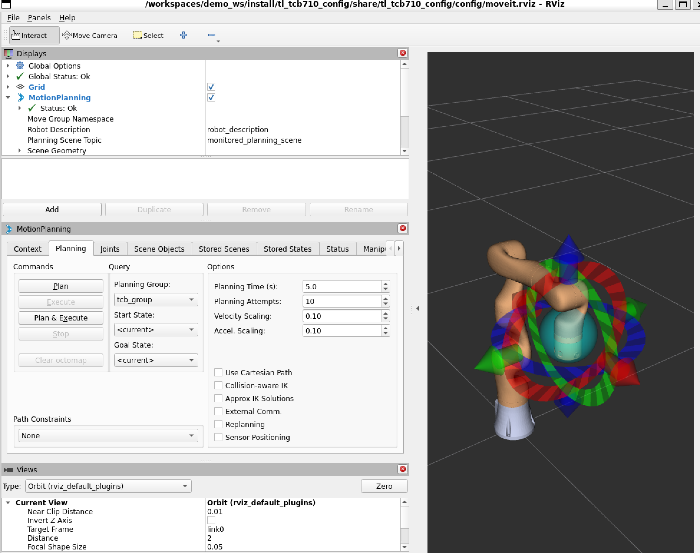
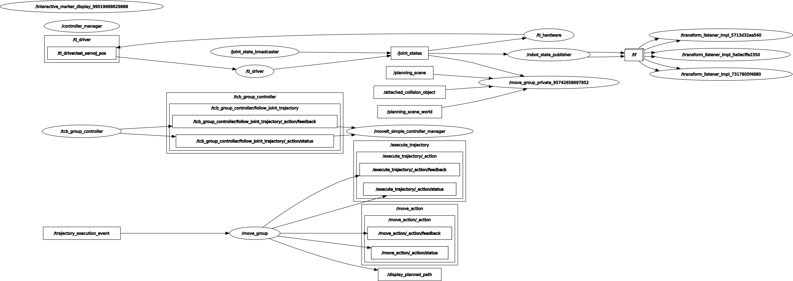

# 天链机器人 tl_moveit2_config 使用说明书

## 目录

- [1. tl_moveit2_config 说明](#1-tl_moveit2_config-说明)
- [2. tl_moveit2_config 使用](#2-tl_moveit2_config-使用)
  - [2.1 MoveIt2 控制虚拟机械臂](#21-moveit2-控制虚拟机械臂)
  - [2.2 MoveIt2 控制真实机械臂](#22-moveit2-控制真实机械臂)
- [3. tl_moveit2_config 架构说明](#3-tl_moveit2_config-架构说明)
  - [3.1 功能包文件总览](#31-功能包文件总览)
- [4. tl_moveit2_config 话题说明](#4-tl_moveit2_config-话题说明)

---

## 1. tl_moveit2_config 说明

`tl_moveit2_config` 功能包集为实现 MoveIt2 控制天链（TianLian）机械臂的功能包集合，其主要作用为调用官方的 MoveIt2 框架，结合 `tl_description` 提供的 URDF 模型，生成适配于天链各型号机械臂的 MoveIt2 配置和启动文件。通过该功能包集可以实现 MoveIt2 控制虚拟机械臂和控制真实机械臂。

目前支持的天链机械臂型号：tcb605、tcb605f、tcb605l、tcb605lv、tcb605v、tcb610、tcb610v、tcb705、tcb705f、tcb705l、tcb705lv、tcb705v、tcb710、tcb710v。

* 1.功能包使用。
* 2.功能包架构说明。
* 3.功能包话题说明。

通过这三部分内容的介绍可以帮助大家：

* 1.了解该功能包集的使用。
* 2.熟悉功能包中的文件构成及作用。
* 3.熟悉功能包相关的话题，方便开发和使用。

---

## 2. tl_moveit2_config 使用

### 2.1 MoveIt2 控制虚拟机械臂

首先配置好环境完成连接后我们可以通过以下命令直接启动节点。

```bash
ros2 launch tl_<arm_type>_config demo.launch.py
```

在实际使用时需要将 `<arm_type>` 更换为实际的机械臂型号，可选的机械臂型号见第 1 节。

例如 tcb710 机械臂的启动命令：

```bash
ros2 launch tl_tcb710_config demo.launch.py
```

节点启动成功后，将显示以下画面。



接下来我们可以通过拖动控制球使机械臂到达目标位置，然后点击规划执行。


规划执行。


### 2.2 MoveIt2 控制真实机械臂

MoveIt2 通过 ros2_control 框架连接真实的机械臂硬件。`tl_hardware` 包提供 `TLHardwareInterface` 硬件接口插件，桥接 ros2_control 与 `tl_driver` 节点。

#### 2.2.1 启动步骤

**前置条件：** 已完成工作空间编译并 source，机械臂控制器已通电并接入网络。

**第 1 步：启动机械臂驱动**

```bash
ros2 launch tl_driver tl_<arm_type>_driver.launch.py
```

驱动启动并成功连接机械臂后，`/joint_states` 话题会持续发布关节状态数据。

**第 2 步：启动 MoveIt2 真实硬件控制**

```bash
ros2 launch tl_<arm_type>_config real_hardware_demo.launch.py
```

例如 tcb710 机械臂的完整启动命令：

```bash
ros2 launch tl_driver tl_tcb710_driver.launch.py
ros2 launch tl_tcb710_config real_hardware_demo.launch.py
```

启动成功后，MoveIt2 的 RViz2 界面将显示当前机械臂的真实关节状态。

#### 2.2.2 注意事项

- 确保 `tl_driver` 启动后成功连接机械臂（终端输出显示 `Connected` 状态）。
- MoveIt2 真实硬件控制默认关闭仿真时间（`use_sim_time:=false`），使用系统时钟。
- `real_hardware_demo.launch.py` 内部调用 `xacro` 时传入 `use_real_hardware:=true` 参数，从而加载 `tl_hardware/TLHardwareInterface` 插件，而非虚拟模式下的 `mock_components/GenericSystem`。
- 6 轴臂型（TCB605/610 系列）和 7 轴臂型（TCB705/710 系列）的配置均支持真实硬件控制，关节数差异自动由对应 SRDF 和 ros2_control 配置处理。

#### 2.2.3 架构说明

真实机械臂的控制链路如下：

```
RViz2 (规划可视化)
  ↑ 规划请求 / 执行结果 ↓
move_group (MoveIt2 运动规划)
  ↓ FollowJointTrajectory action
moveit_simple_controller_manager
  ↓
joint_trajectory_controller (ros2_control)
  ↓ 位置指令 (rad)
TLHardwareInterface (tl_hardware 硬件接口插件)
  ↓ 发布 / 订阅
┌────────────────────────────────────┐
│  subscriber: /joint_states         │ ◄── tl_driver 发布关节状态
│  publisher:  /tl_driver/set_servoj_pos  │ ──► tl_driver 接收位置指令
│  client:     /tl_driver/open_servoj    │ ──► 启动 servoj 流模式
│  client:     /tl_driver/close_servoj   │ ──► 关闭 servoj 流模式
└────────────────────────────────────┘
  ↓ TCP/IP
机械臂控制器
```

**关键点：**
- `TLHardwareInterface` 从 `/joint_states` 读取关节状态（位置、速度、力矩）并写入 ros2_control 状态接口。
- `joint_trajectory_controller` 规划的位置指令（弧度）通过 `write()` 转换为角度，发布到 `/tl_driver/set_servoj_pos`。
- 激活时自动调用 `/tl_driver/open_servoj` 开启 servoj 流模式，并等待首帧关节状态数据。
- 停用时通过 `/tl_driver/close_servoj` 关闭流模式。

---

## 3. tl_moveit2_config 架构说明

### 3.1 功能包文件总览

`tl_moveit2_config` 为 ROS2 功能包集合，由 MoveIt2 Setup Assistant 生成，包含 14 个臂型子功能包。每个子功能包均独立生成且结构一致。

```
tl_moveit2_config/
├── .setup_assistant                    # MoveIt2 Setup Assistant 全局配置
├── README.md                           # 本说明文档
├── tl_tcb605_config/                   # tcb605 机械臂 MoveIt2 配置功能包
│   ├── .setup_assistant                # Setup Assistant 配置记录
│   ├── CMakeLists.txt                  # 编译规则
│   ├── package.xml                     # 包描述文件
│   ├── config/                         # 配置参数文件夹
│   │   ├── initial_positions.yaml      # 初始化位姿（各关节默认角度）
│   │   ├── joint_limits.yaml           # 关节运动限制（速度/加速度/位置）
│   │   ├── kinematics.yaml             # 运动学求解器配置（KDL）
│   │   ├── moveit_controllers.yaml     # MoveIt2 控制器配置
│   │   ├── moveit.rviz                 # RViz2 显示配置文件
│   │   ├── pilz_cartesian_limits.yaml  # Pilz 笛卡尔规划器限制
│   │   ├── ros2_controllers.yaml       # ros2_control 控制器配置
│   │   ├── tl_tcb605.ros2_control.xacro # ros2_control Xacro 描述
│   │   ├── tl_tcb605.srdf              # SRDF（语义机器人描述格式）
│   │   └── tl_tcb605.urdf.xacro        # URDF Xacro 描述（含 ros2_control）
│   └── launch/                         # 启动文件文件夹
│       ├── demo.launch.py              # 虚拟机械臂 MoveIt2 启动文件
│       ├── real_hardware_demo.launch.py # 真实机械臂 MoveIt2 启动文件（所有臂型均已适配）
│       ├── gazebo_moveit_demo_tcb605.launch.py   # Gazebo 仿真 MoveIt2 启动文件
│       ├── move_group.launch.py        # move_group 启动文件
│       ├── moveit_rviz.launch.py       # RViz2 可视化启动文件
│       ├── rsp.launch.py               # robot_state_publisher 启动文件
│       ├── setup_assistant.launch.py   # Setup Assistant 启动文件
│       ├── spawn_controllers.launch.py # 控制器启动文件
│       ├── static_virtual_joint_tfs.launch.py # 静态虚拟关节 TF 发布
│       └── warehouse_db.launch.py      # warehouse 数据库启动文件
├── tl_tcb605f_config/                  # tcb605f 配置（文件解释参考 tcb605）
├── tl_tcb605l_config/                  # tcb605l 配置（文件解释参考 tcb605）
├── tl_tcb605lv_config/                 # tcb605lv 配置（文件解释参考 tcb605）
├── tl_tcb605v_config/                  # tcb605v 配置（文件解释参考 tcb605）
├── tl_tcb610_config/                   # tcb610 配置（文件解释参考 tcb605）
├── tl_tcb610v_config/                  # tcb610v 配置（文件解释参考 tcb605）
├── tl_tcb705_config/                   # tcb705 配置（文件解释参考 tcb605）
├── tl_tcb705f_config/                  # tcb705f 配置（文件解释参考 tcb605）
├── tl_tcb705l_config/                  # tcb705l 配置（文件解释参考 tcb605）
├── tl_tcb705lv_config/                 # tcb705lv 配置（文件解释参考 tcb605）
├── tl_tcb705v_config/                  # tcb705v 配置（文件解释参考 tcb605）
├── tl_tcb710_config/                   # tcb710 配置（文件解释参考 tcb605，7关节）
├── tl_tcb710v_config/                  # tcb710v 配置（文件解释参考 tcb605，7关节）
└── doc/                                # 文档图片文件夹
    └── ...
```

各子功能包文件作用说明：

| 文件 | 作用 |
|------|------|
| `CMakeLists.txt` | 编译规则 |
| `package.xml` | 包描述文件 |
| `config/initial_positions.yaml` | 初始化位姿 |
| `config/joint_limits.yaml` | 关节限制 |
| `config/kinematics.yaml` | 运动学参数 |
| `config/moveit_controllers.yaml` | MoveIt2 控制器 |
| `config/moveit.rviz` | RViz2 显示配置 |
| `config/pilz_cartesian_limits.yaml` | Pilz 笛卡尔限制 |
| `config/ros2_controllers.yaml` | ros2_control 控制器 |
| `config/<arm>.ros2_control.xacro` | Xacro 描述文件 |
| `config/<arm>.srdf` | MoveIt2 控制配置文件 |
| `config/<arm>.urdf.xacro` | URDF Xacro 描述文件 |
| `launch/demo.launch.py` | 虚拟机械臂 MoveIt2 启动文件（使用 `mock_components/GenericSystem`） |
| `launch/real_hardware_demo.launch.py` | 真实机械臂 MoveIt2 启动文件（使用 `tl_hardware/TLHardwareInterface`） |
| `launch/gazebo_moveit_demo_<arm_type>.launch.py` | Gazebo 仿真 MoveIt2 启动文件，`arm_type` 如 `tcb605`（不含 tl_ 前缀） |
| `launch/move_group.launch.py` | move_group 启动文件 |
| `launch/moveit_rviz.launch.py` | RViz2 可视化启动文件 |
| `launch/rsp.launch.py` | robot_state_publisher 启动文件 |
| `launch/setup_assistant.launch.py` | Setup Assistant 启动文件 |
| `launch/spawn_controllers.launch.py` | 控制器启动文件 |
| `launch/static_virtual_joint_tfs.launch.py` | 静态虚拟关节 TF 发布 |
| `launch/warehouse_db.launch.py` | warehouse 数据库启动文件 |

---

## 4. tl_moveit2_config-话题说明

为清晰展示 MoveIt2 控制真实机械臂时各节点间的话题通信关系，在启动 `real_hardware_demo.launch.py`（同时 `tl_driver` 已运行并连接机械臂）后，可通过如下指令查看实时 rqt_graph：

```bash
ros2 run rqt_graph rqt_graph
```

运行成功后界面将显示如下画面。



该图反映了当前运行的节点与节点之间的话题通信关系，首先查看 `/joint_states` 话题。

由图可知，`/joint_states` 话题由 `tl_driver` 发布，`joint_state_broadcaster` 获取 ros2_control 状态接口中的反馈数据后也向该话题转发。`/joint_states` 被 `/robot_state_publisher` 节点和 `/tl_hardware` 节点订阅。`/robot_state_publisher` 接收 `/joint_states` 是为了持续发布关节间的 TF 变换；`/tl_hardware` 接收 `/joint_states` 是为了获取当前机械臂的关节状态信息，作为 ros2_control 控制闭环的状态反馈输入。

`tl_hardware` 同时发布了 `/tl_driver/set_servoj_pos` 话题，该话题是机械臂透传功能的话题，通过该话题 `tl_hardware` 将规划的关节位置指令发布给 `tl_driver` 节点，`tl_driver` 接收后控制机械臂进行运动。

`tl_hardware` 为 `tl_driver` 与 MoveIt2 之间通信的桥梁，其通过 `/tcb_group_controller/follow_joint_trajectory` 动作与 `/moveit_simple_controller_manager` 进行通信，获取规划点，并进行插值运算，将插值之后的数据通过透传的方式给到 `tl_driver`。

MoveIt2 本身涉及的节点有 `move_group`、`move_group_private`、`moveit_simple_controller_manager`，它们的主要作用为实现机械臂的运动规划，并将规划信息等数据显示在 RViz2 中，另一方面还需要将规划数据传递到 `tl_hardware` 端，进行进一步细分。

---

## 常见问题

**Q：如何为现有臂型重新生成 MoveIt2 配置？**

A：使用 MoveIt2 Setup Assistant 打开对应的 SRDF 文件：
```bash
ros2 launch tl_<arm_type>_config setup_assistant.launch.py
```

**Q：如何修改关节速度/加速度限制？**

A：编辑对应臂型的 `config/joint_limits.yaml` 中的 `default_velocity_scaling_factor` 和 `default_acceleration_scaling_factor`，值域 (0, 1.0]。

**Q：启动后 RViz2 中不显示模型？**

A：确保已正确编译工作空间（`colcon build`）并 source `install/setup.bash`。检查 `tl_description` 功能包已正确安装。

**Q：真实硬件启动后，RViz2 中关节不跟随实际位置？**

A：确认 `tl_driver` 已成功连接机械臂并发布 `/joint_states` 话题：
```bash
ros2 topic echo /joint_states
```
如果话题无数据，检查 `tl_driver` 配置 YAML 中的 `arm_ip` 和 `arm_port` 是否正确。

**Q：`joint_state_broadcaster` 在真实硬件模式中是否必要？**

A：在真实硬件模式下，`joint_state_broadcaster` 将 `TLHardwareInterface` 状态接口中的关节数据重新发布到 `/joint_states`。由于 `tl_driver` 已经持续发布 `/joint_states`（`TLHardwareInterface` 正是从该话题读取数据），broadcaster 实际上是在重复发布相同的数据，因此并非必需。保留它的好处是同一套 `ros2_controllers.yaml` 同时兼容虚拟模式和真实模式，避免维护两份配置。

**Q：启动时报错 "Failed to find hardware interface tl_hardware/TLHardwareInterface"？**

A：确认 `tl_hardware` 包已编译安装：
```bash
colcon build --packages-select tl_hardware
source install/setup.bash
```

**Q：如何调节 servoj 流的运动参数（速度、加速度）？**

A：在 `<arm>.ros2_control.xacro` 的 `TLHardwareInterface` 插件配置中添加 `servoj_vmax`、`servoj_amax`、`servoj_jmax` 参数。默认值为 30.0 deg/s、100.0 deg/s²、500.0 deg/s³。支持单值（应用到所有关节）或以逗号分隔的逐关节值。

**Q：真实硬件控制支持哪些臂型？**

A：所有 14 种臂型均支持。6 轴系列（TCB605*/TCB610*）配置 6 个关节，7 轴系列（TCB705*/TCB710*）配置 7 个关节。各臂型的配置文件结构一致，区别仅在于关节数量和 SRDF 碰撞对。
